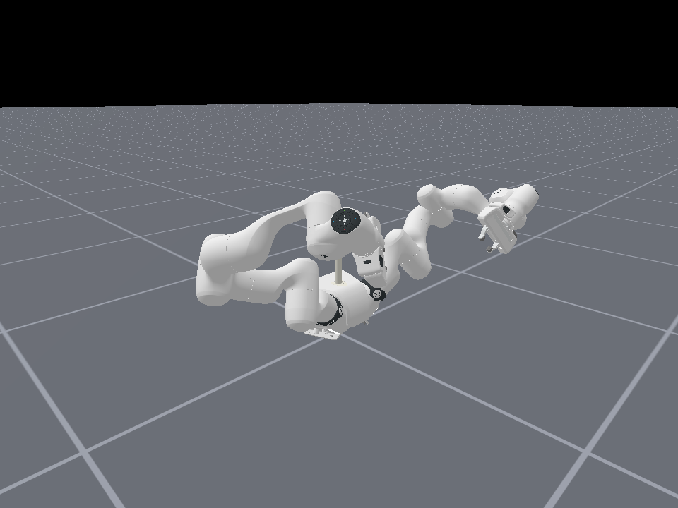

# FR3 双臂导入与线缆实验（第一阶段）

本目录现在默认加载 **Franka Robotics 官方 FR3 Duo 模型**。随示例保留的旧版 CAD
导出版本没有删除，改为备用类 `FR3DualArmCAD`，方便随时对照和回退。
当前已经验证机器人加载、两种关节控制模式、左右臂运动、两只夹爪同步开合和
CPU Vulkan 渲染。本目录还加入了第一个线缆环境 `FR3Cable-v1`：线缆能够生成、
完整重置，并在重力作用下落到双臂前方的桌面上。



## 先直接运行

在仓库根目录执行：

```bash
conda activate maniskill3
cd /path/to/ManiSkill

# 1. 不启动仿真，只核对 URDF、mesh、关节、TCP、限位和惯量。
python -m examples.tutorials.fr3_rope.tools.inspect_model

# 2. CPU 无窗口实例化，两种控制模式分别保持 100 步。
python -m examples.tutorials.fr3_rope.check

# 3. 再让双臂和两只夹爪作小幅运动。
python -m examples.tutorials.fr3_rope.check --motion

# 4. 打开交互窗口；关闭窗口或按 Ctrl+C 退出。
python -m examples.tutorials.fr3_rope.demos.robot_demo

# 5. 官方模型完整运动演示。先保持 100 步，再运动 100 步。
python -m examples.tutorials.fr3_rope.demos.robot_demo --motion all --steps 100

# 6. 无窗口运行第一个线缆实验，并自动检查自由落体、桌面接触和数值稳定性。
python -m examples.tutorials.fr3_rope.demos.cable_demo --headless --steps 200

# 7. 打开线缆实验窗口；关闭窗口或按 Ctrl+C 退出。
python -m examples.tutorials.fr3_rope.demos.cable_demo
```

如果电脑的 NVIDIA/Vulkan 驱动不可用，可以让渲染也走 CPU：

```bash
python -m examples.tutorials.fr3_rope.demos.robot_demo --render-backend cpu
```

## 文件分别做什么

```text
examples/tutorials/fr3_rope/
├── agent.py                 # 从标准模板实例化的通用 Agent 实现
├── robot.py                 # 只填写官方 FR3 + 旧 CAD 备用配置
├── validation.py            # URDF、关节、TCP、限位和资产静态检查
├── check.py                 # FR3 两种控制模式的统一验收入口
├── actors/
│   └── rope.py              # 可复用的多段刚体线缆构建器
├── envs/
│   └── cable_env.py         # FR3Cable-v1 第一阶段环境
├── demos/
│   ├── robot_demo.py        # 机器人窗口、运动、接触和截图
│   └── cable_demo.py        # 线缆窗口演示和无窗口自动体检
├── tools/
│   └── inspect_model.py     # 不启动仿真的模型体检
├── tests/
│   ├── test_import.py       # FR3 Agent 自动回归测试
│   └── test_cable.py        # 线缆几何、重置、接触和稳定性测试
├── preview.png              # 官方模型的 CPU Vulkan 实际截图
├── assets/
│   ├── franka_description/  # 官方模型、生成 URDF、许可证和来源记录
│   └── FR3-dual-arm_description_0820/  # 旧 CAD 包，原样保留
└── reference/Rope-Actor/    # 原文件，作为来源对照
```

## 第一个线缆环境做了什么

`actors/rope.py` 从 `reference/Rope-Actor/create_actors.py` 提取出线缆建模方法。线缆由
若干胶囊刚体组成；相邻实体段之间串联 x、y、z 三个旋转关节，使它能够弯曲和
扭转。默认 20 段，因此线缆有 `3 × (20 - 1) = 57` 个内部自由度。

`envs/cable_env.py` 把官方 FR3 Duo、桌面和线缆组合成注册环境 `FR3Cable-v1`。每次
`reset()` 都会恢复两台机器人、两只夹爪、线缆根位姿、57 个关节位置与速度，
避免只重置外观位置而留下上一回合速度。物理仿真使用 200 Hz，控制频率为 20 Hz。

当前环境故意只支持 `reward_mode="none"`，也不返回 `success`：这一阶段验证的是
“线缆模型可以稳定运行”，不是“机器人已经学会抓取线缆”。`evaluate()` 提供的是
线缆最低/最高点、最大关节速度、根部速度以及是否出现 NaN/Inf 等体检指标。

可以改变分段数，但每段必须比直径稍长，否则无法构造有效胶囊碰撞体：

```bash
python -m examples.tutorials.fr3_rope.demos.cable_demo \
  --headless --steps 200 --rope-segments 16

# 另一种已支持的机器人控制模式
python -m examples.tutorials.fr3_rope.demos.cable_demo \
  --headless --steps 200 --control-mode pd_joint_delta_pos
```

## 公开发布前的许可证检查

官方 FR3 资产附带 Apache-2.0 `LICENSE` 和 `NOTICE`。旧版 CAD 包的
`package.xml` 声明为 BSD，但当前归档没有许可证正文，作者和维护者字段仍为
`TODO`；`reference/Rope-Actor` 也没有许可证文件。确认来源和再分发许可之前，
不应在公开发布版本中包含这两个参考目录，也不应将其内容视为已获授权的第三方代码。

官方资产来自
[`frankarobotics/franka_description`](https://github.com/frankarobotics/franka_description)，
固定到发布版 `2.8.1`、commit
`02afaae282d4a8e10d7d2f781b23b3515c303ce5`。运行时使用已经展开的普通
`urdfs/fr3_duo_franka_hand.urdf`，所以运行 ManiSkill 不需要 ROS 或 Xacro。
详细来源和裁剪范围见 `assets/franka_description/SOURCE.md`；Apache-2.0
`LICENSE` 与 `NOTICE` 已一起保留。

## `robot.py` 中最重要的配置

`FR3DualArm` 继承已经验证过的 `RobotAgentTemplate`，注册 uid 仍是
`fr3_dual_arm`。因此环境继续用下面这一个字符串实例化机器人：

```python
gym.make("Empty-v1", robot_uids="fr3_dual_arm", ...)
```

这里的 `RobotAgentTemplate` 来自同一目录的 `agent.py`，静态检查也来自同一目录的
`validation.py`，FR3 不再依赖相邻的 `robot_agent_template` Python 包。这样复制整个
`fr3_rope` 目录时，机器人导入、检查、环境和演示仍然是一套完整代码。
导入 `examples.tutorials.fr3_rope` 时会同时注册 FR3 Agent 和 `FR3Cable-v1` 环境。

官方 `fr3_duo` 默认由两台 **FR3 v2**、双臂安装座、头部和两个
`franka_hand` 组成。它不是旧 CAD 中“桌架 + 台板 + 布线槽 + 双臂”的整套实验台。
正式线缆环境需要把桌面和布线槽作为场景物体单独加载，不能期待官方机器人 URDF
自动包含实验台。

模型有 59 个 link、58 个 joint，其中 14 个旋转关节、4 个手指平移关节，
其余 40 个是固定连接。完整 qpos 是 18 维；每只手的第二根手指通过 mimic
跟随第一根，因此 action 是 16 维：

| 动作切片 | 控制对象 | 数量 |
| --- | --- | ---: |
| `0:7` | 左臂 `left_fr3v2_joint1..7` | 7 |
| `7:14` | 右臂 `right_fr3v2_joint1..7` | 7 |
| `14` | 左夹爪开合 | 1 |
| `15` | 右夹爪开合 | 1 |

注意，SAPIEN 实际 qpos 顺序是左右臂交错的，不能把完整 qpos 直接当作 action。
示例统一调用 `agent.action_from_qpos(target)` 完成名称到控制器顺序的映射。

官方模型还直接给出两个抓取参考：

- `agent.left_tcp` → `left_fr3v2_hand_tcp`
- `agent.right_tcp` → `right_fr3v2_hand_tcp`

初始姿态使用官方 SRDF 的 `ready` 状态，夹爪使用 `open=0.035 m`。PD 增益是
ManiSkill 仿真的起始值，不应直接作为 FR3 实机控制参数。

## 本次实际验证结果

| 检查 | 结果 |
| --- | --- |
| 官方来源、许可证、URDF 和 25 个 mesh 路径 | 通过 |
| 59 个 link、18 个活动关节、两组 mimic、两个 TCP | 通过 |
| 25 个物理 link 的正质量/正定惯量基本检查 | 通过 |
| 所有活动关节的 effort、velocity 和位置限位 | 均为有效正值/有限范围 |
| `pd_joint_pos` 保持 100 步 | 通过 |
| `pd_joint_delta_pos` 保持 100 步 | 通过 |
| 两种模式下双臂与两只夹爪小幅运动 | 通过 |
| CPU Vulkan 渲染 | 通过，见 `preview.png` |
| 20 段/57 DOF 线缆生成与完整 reset | 通过 |
| 线缆自由落体、20 段桌面接触、无穿透、无 NaN/Inf | 两种控制模式均通过 |
| 机器人主动靠近并抓取线缆 | 尚未实现 |
| 抓取成功条件、奖励、GPU 并行仿真 | 尚未实现/验证 |

运行回归测试：

```bash
python -m unittest \
  examples.tutorials.fr3_rope.tests.test_import \
  examples.tutorials.fr3_rope.tests.test_cable \
  examples.tutorials.robot_agent_template.tests.test_template -v
```

## 当前必须知道的限制

### 1. FR3 的具体硬件版本仍需确认

“FR3”存在 `fr3`、`fr3v2`、`fr3v2_1` 等官方变体。本次采用的是官方
`fr3_duo` 在 2.8.1 中的默认值：左右两台 `fr3v2`。连接真实硬件前，需要确认实际
机械臂的准确型号；若不是 FR3 v2，应重新生成对应官方 URDF，不能只改类名。

### 2. 暂时关闭机器人内部碰撞

官方 SRDF 有 177 对碰撞过滤，并使用 `Adjacent`、`Never`、`UserDisable`、
`Default` 等 reason。当前 SAPIEN 3.0.3 只识别 `reason="Default"`，会漏掉例如
hand 与 link7 的必要过滤，从而产生很大的假接触冲量。因此 `FR3DualArm` 暂时设置
`disable_self_collisions=True`。这只关闭机器人 link 彼此之间的碰撞，机器人与线缆、
桌面等外部物体的碰撞仍保留。正式任务前应实现适合 SAPIEN 的碰撞过滤，而不是长期
依赖全局关闭自碰撞。

### 3. 旧 CAD 模型仍可复现

```bash
# 检查旧模型
python -m examples.tutorials.fr3_rope.tools.inspect_model --model cad

# 打开旧模型窗口
python -m examples.tutorials.fr3_rope.demos.robot_demo --model cad
```

旧模型注册为 `fr3_dual_arm_cad`。它没有专用 TCP、关节 effort/velocity 为零，
并且左右夹爪轴和碰撞模型存在已知问题，因此不再作为默认实现。

## 下一步

1. 确认 `fr3v2` 是否与实际硬件一致，以及双臂、桌面和布线槽的准确安装位姿。
2. 按真实尺寸替换当前用于验证的简单桌面，并加入布线槽等实验场景物体。
3. 先写一个非学习的关节位置动作，让一个夹爪靠近线缆；再验证夹爪—线缆接触与闭合。
4. 最后定义“抓住/提起/移动到目标区域”的成功条件和观测，之后才考虑奖励或强化学习。
